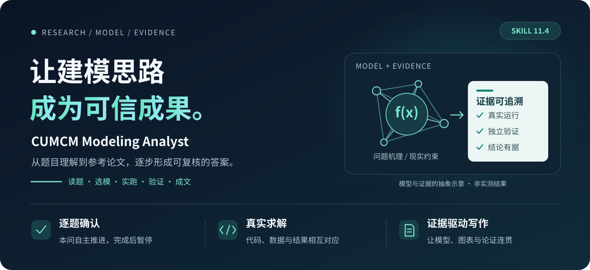
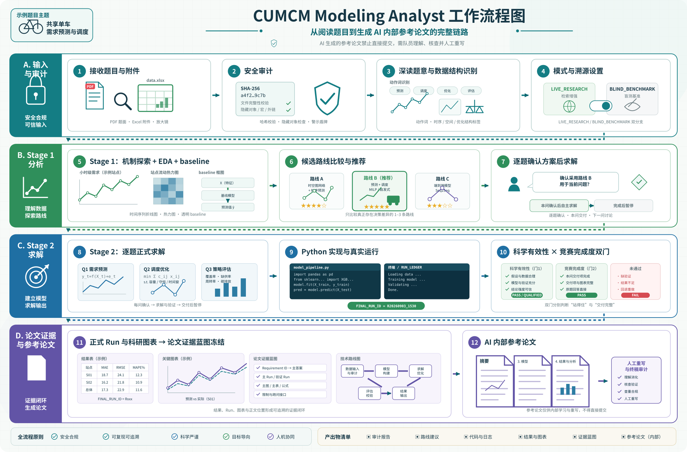

> **重要：AI 生成的参考论文不能直接提交。参赛队员需要理解、核验并自行重写。**

<p align="center">
  
</p>

<p align="center">
  <a href="assets/readme-showcase/cumcm-readme-workflow.svg">
    
  </a>
</p>

<div align="center">

# CUMCM Modeling Analyst

面向 CUMCM 及同类数学建模竞赛的 AI 协作 Skill，适配 Codex、Claude Code 等能够读取附件、管理项目、编写代码并真实运行 Python 的 Agent。


</div>

---

## 设计目标

这个 Skill 不追求把 Agent 管成“流程机器人”。真正目标是：

> **让 AI 更容易读对题、找到好路线、真实算出来、验证清楚、画得专业、解释得明白，并最终交付一套队员能接手的成果。**

v11.2 的核心方向是 **competition-first**：

- 科学真实性和交付可靠性仍是硬底线；
- 模型探索和技术实现尽量让 Agent 自主发挥；
- 只有真正影响团队建模决策的事情才需要反复确认；
- 探索成果保持轻量，只有升级为正式证据时才承担完整 QA；
- 同一事实尽量只维护一个权威来源，减少 Run、README、教程和论文之间反复手抄。

---

## 核心流程

```text
初始赛题安全审计（每个赛题工作区仅一次）
→ 读题 + Requirement 骨架
→ Stage 1：机制探索 / EDA / baseline / 候选路线
→ 队员确认整题建模边界和协作模式
→ Stage 2：逐题深解 / 一次性连续求解
→ Python 真实运行 + 独立验证 + 现实约束
→ FINAL_RUN_ID
→ Requirement / Evidence 骨架持续补充
→ PAPER_EVIDENCE_BLUEPRINT_READY
→ 正式科研图表与论文证据选编
→ AI 内部参考论文
→ 队员人工重写 + 终稿复审
→ 当年官方提交导出
```

启动只加载安全审计和核心流程；其他规范由 `manifest.yaml` 按当前阶段加载。

---

## 为什么不会把 Codex 锁死

### 已确认路线内，Codex 默认可自主做

- EDA、异常检查、诊断实验和 baseline；
- 参数、初值、容差、求解器和计算预算调整；
- 代码重构、数值稳定处理和等价数学实现；
- 交叉验证、滚动验证、bootstrap、多 seed、敏感性和上下界检查；
- 满足预先确认条件后切换到已确认备用路线；
- 生成探索图、验证图、方法图和正式论文候选图；
- 上游结果变化后的下游重跑和成果同步。

### 只有这些事需要团队决定

- 改变原题目标、优化方向、交付对象或关键现实约束；
- 新增/删除会明显改变结论的关键假设；
- 需要采用尚未授权、会改变整题逻辑的新路线；
- 关键现实数据缺失，不同处理会改变主答案；
- 多条路线证据接近，选择属于队伍风险偏好或论文策略。

**调参失败、数值求解器更换、普通代码问题，不等于“路线重开”。**

---

## 主要能力

| 能力 | 做什么 |
|---|---|
| 一次性读题安全审计 | 首次接收题面与官方附件时检查隐藏对象、透明内容、嵌入对象和疑似 Prompt Injection，之后整个赛题工作区复用审计结果 |
| Requirement 骨架 | 读题后先固定动作词、交付对象、单位、硬约束和跨问依赖，避免后面模型做复杂却答偏题 |
| 自由机制探索 | 先理解数据/现实机制，再用 EDA、小实验和 baseline 筛路线，不从模型清单机械套方法 |
| 证据选模 | `QUALITY_GATES_ARE_AUDITORS_NOT_MODEL_SELECTORS`，质量门负责淘汰不适用/不可验证路线，不预先限制模型家族 |
| 双求解模式 | 逐题确认适合团队深度讨论；一次性连续模式适合路线已确认后让 Agent 连续推进 |
| 真实外部数据 | 只有现实数据/参数/标准确实影响模型或结论时才加载外部研究流程，缺数据不编造 |
| 真实 Python 运行 | 每问明确 `FINAL_RUN_ID`，最终数字、图表和论文都从 Final/Validation Run 读取 |
| 建模质量门 | 检查数据结构、模型前提、验证单位、现实约束、泄漏、随机算法稳定性和结论强度 |
| 两级科研绘图 | `QUICK_EXPLORATION` 允许快速 EDA；`FORMAL_EVIDENCE` 才执行完整论文级溯源和 A4 视觉 QA |
| Evidence Blueprint | 读题后建立骨架、逐问增量补充、全部 Final Run 后冻结，不到最后才突然整理 |
| 参考论文 | 重点解释为什么假设、为什么选模、如何求解、结果为什么可信，而不是模型名堆砌或 Agent 日志 |
| 终稿复审 | 从快速阅读链、数学模型、数字、单位、公式、图表、引用和跨成果一致性复审队员终稿 |
| 内部四包 | 题目详解 / 参考论文 / 源码 / 其他；ZIP 必须实际解压验收，不允许空包假完成 |
| 盲测溯源 | 独立方案先冻结，之后才打开历史答案/优秀论文；后学内容标记 `POST_HOC` |

---

## Stage 1：先研究，而不是先选模型名

推荐研究循环：

```text
识别关键困难
↓
提出可能机制 / 数学结构
↓
设计能区分这些机制的小实验或 EDA
↓
建立透明 baseline / 合理参照
↓
根据真实证据保留、修改或放弃路线
↓
最后用质量门审计候选
```

候选通常 1–3 个，路线明显时不凑数。证据不足时不制造“87 分 vs 84 分”这类虚假精确推荐指数。

详细规则：[`references/modeling-quality-gates.md`](references/modeling-quality-gates.md)

---

## Stage 2：两种协作方式

### 逐题深度求解

```text
当前问研究与方案
→ 队员确认建模边界
→ Agent 自主完成代码 / 实验 / 验证 / 绘图
→ FINAL_RUN_ID
→ 直接答案 + 下一问接口
→ 下一问
```

确认的是目标、关键假设、主路线/备用路线和重要约束，不是每一个超参数。

### 一次性连续求解

整题路线确认后连续执行，不在各问之间常规暂停。只有真的需要改目标、关键假设、关键现实约束或未授权路线时才回来沟通。

---

## 科研图片：探索快，定稿严

### QUICK_EXPLORATION

适合：

- EDA；
- 调试；
- 变量关系探索；
- 候选筛选；
- 快速验证机制猜想。

要求真实、不误导、基本标签和单位清楚即可，不需要每张都填论文证据契约和导出三种格式。

### FORMAL_EVIDENCE

只有准备进入正式成果的：

```text
PAPER_FIGURE
VALIDATION_FIGURE
METHOD_FIGURE
```

才要求完整链：

```text
Requirement / 结论
↔ 源数据或最终方法
↔ Final/Validation Run（数据图）
↔ 绘图脚本
↔ 图片文件
↔ 最终尺寸 / 字体 / 误差 / 可读性 QA
```

详细规则：[`references/python-visualization-policy.md`](references/python-visualization-policy.md)

---

## Evidence Blueprint：从读题就开始，但最后才冻结

旧思路容易变成“全部算完后突然整理一大张表”。v11.2 改为：

```text
EARLY_SKELETON
→ 每问 Final Run 后持续补充
→ 全题 Final/Validation Run 冻结
→ FINAL_FREEZE
→ PAPER_EVIDENCE_BLUEPRINT_READY
→ 完整参考论文
```

权威蓝图只有一份：

```text
02_analysis/PAPER_EVIDENCE_BLUEPRINT.md
```

`05_paper/` 不再复制第二份蓝图，减少版本串线。

内部仍然可以使用：

```text
FINAL_RUN_ID
SCIENTIFIC_VALIDITY
CONTEST_TASK_COMPLETION
A/B/C evidence grade
PAPER_CORE / PAPER_SUPPORT / RUN_ONLY
```

但正式论文正文不需要展示这些 Agent 状态词。论文应该给评委看真实验证、误差、稳定性、现实约束和适用范围。

---

## 参考论文：重点是建模论证

参考论文应持续回答：

```text
为什么这样处理？
为什么需要这些假设？
为什么选这个模型？
公式和现实约束如何建立？
算法为什么这样求解？
结果具体是什么？
为什么可信？
对后续问题有什么作用？
```

尤其避免：

```text
根据问题分析
→ 建立 XX 模型
→ 使用 Python 求解
→ 结果如下图表
```

软件只是求解工具，不是论证。

详细规则：[`references/reference-paper-writing.md`](references/reference-paper-writing.md)

---

## 文献核验：真实 ≠ 公开可下载

v11.2 把两件事分开：

1. 文献是否真实、是否实际读过、是否支持当前主张；
2. 是否存在稳定的公开全文下载入口。

如果队员已经合法提供全文，Agent 实际读过关键内容，即使出版社页面需要机构权限，也可以作为真实学术依据；但不能声称“公开可下载”。

只有你明确提供“下载链接”时，才要求 `DOWNLOAD_VERIFIED`。

详细规则：[`references/source-verification-policy.md`](references/source-verification-policy.md)

---

## Codex 单赛题工作区

```text
2022-C/
├─ README.md
├─ 00_problem/                 # 原题、官方附件和模板
├─ 01_data/                    # raw / processed / external
├─ 02_analysis/                # 题意、假设、符号、方案、教程、Evidence Blueprint
├─ 03_code/                    # 正式 Python
├─ 04_results/                 # figures / tables / data / logs
├─ 05_paper/                   # 提纲、参考稿和队员终稿
├─ 06_submission/              # 内部四包与官方提交候选
├─ 07_references/              # 论文、网页和资料笔记
└─ 99_temp/                    # 可清理临时文件
```

中文文件名是新建中文项目的可读性偏好，不是科学正确性的硬门。已有英文仓库、Python 包、Notebook、CI 或跨平台工具链直接继承现有稳定约定。

---

## 辅助工具

### 记录一次重要真实运行

```bash
python scripts/run_record.py \
  --root . \
  --problem Q1 \
  --purpose "最终模型" \
  --status FINAL \
  --input 01_data/processed/q1.csv \
  --output 04_results/data/q1/result.csv \
  -- python 03_code/q1/main.py
```

FINAL 命令失败时不会被错误登记成最终结果。

### 科研图公共保存工具

```python
from scripts.figure_utils import apply_readable_defaults, save_figure

apply_readable_defaults()
# ... 正常绘图 ...
save_figure(fig, "04_results/figures/q1/paper/预测结果")
```

工具不固定颜色、不决定图型，只处理字体和机械保存。

### 实际验收 ZIP

```bash
python scripts/delivery_check.py 06_submission/internal_delivery/*.zip
```

会做 CRC、路径安全、实际解压、DOCX/PDF/Python 基本检查，避免“压缩包存在但实际上为空/打不开”。

---

## 旧题盲测

```text
BLIND_RUN_STARTED
→ BLIND_SOLUTION_FROZEN
→ POST_SOLUTION_COMPARISON
→ POST_HOC_IMPROVEMENT
```

原则：

> **禁止搜答案，不禁止查现实。**

打开历史优秀论文、答案或讲评前先冻结独立成果和 hash；后续学到的新模型、图表和解释都标记 `POST_HOC`。

README 不直接展示旧题结果图，避免污染后续同题盲测。

---

## 快速开始

```bash
git clone https://github.com/zhu-hailin/cumcm-modeling-analyst.git
```

然后在支持 Skill 的 Agent 中说：

```text
使用 cumcm-modeling-analyst 分析这道数学建模赛题。
```

旧题盲测时额外声明：

```text
这是旧题盲测，不允许定位或读取历史答案；可以核验通用理论、软件文档和去题目标识化的现实资料。
```

---

## 仓库结构

```text
.
├── SKILL.md
├── manifest.yaml
├── README.md
├── agents/openai.yaml
├── scripts/
│   ├── quick_validate.py
│   ├── run_record.py
│   ├── figure_utils.py
│   └── delivery_check.py
├── tests/
│   ├── test_old_problem_forward_contract.py
│   └── test_competition_first_contract.py
├── assets/
│   ├── PAPER_EVIDENCE_BLUEPRINT_TEMPLATE.md
│   ├── QUESTION_BY_QUESTION_SOLUTION_TEMPLATE.md
│   ├── STAGE2_ONE_PASS_SOLUTION_TEMPLATE.md
│   └── FINAL_PAPER_AUDIT_TEMPLATE.md
└── references/
    ├── problem-ingestion-security.md
    ├── core-workflow.md
    ├── modeling-quality-gates.md
    ├── model-run-ledger.md
    ├── python-visualization-policy.md
    ├── paper-evidence-architecture.md
    ├── reference-paper-writing.md
    ├── source-verification-policy.md
    ├── final-paper-audit.md
    └── ...
```

---

## 边界

这个项目不承诺自动获奖，也不能替代参赛队员判断。它追求的是：

> **少做不会改变决策的流程，多做能改变答案质量的研究。**

如果你发现题意误读、虚构数据、错误选模、数据泄漏、旧 Run 混用、误导图表、空 ZIP 或论文一致性问题，欢迎提交 Issue / PR，并尽量附可复现证据。
