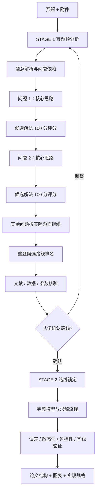

<div align="center">

# 🏆 CUMCM Modeling Analyst

### 面向全国大学生数学建模竞赛的 AI 建模分析 Skill

**逐问核心思路 · 100 分方案评分 · 真实文献核验 · 路线锁定 · 整题一次性求解**


**不是“看到关键词就套模型”，而是先把赛题想清楚，再决定用什么模型。**

</div>

---

## 这是什么？

`cumcm-modeling-analyst` 是一个面向 **全国大学生数学建模竞赛（CUMCM）及同类数学建模赛事** 的分析型 AI Skill。

它把 AI 的角色从“模型名称生成器”变成 **建模总设计师 + 文献审查员 + 质量守门员**：先读题、拆题、分析每一问的核心逻辑，再比较候选方法，最后锁定一条能够贯穿整题的建模路线。

它尤其适合这样的场景：

- 拿到赛题后，不知道三问或多问之间到底是什么关系；
- 能想到很多模型，但不知道哪个真正适合题目；
- 希望 AI 先给出多个可行方案，再用统一标准比较，而不是随意推荐；
- 需要真实论文、官方数据和参数来源支撑建模；
- 担心各问“各做各的”，最后论文像模型拼盘；
- 希望在 Coding Agent 开始写代码前，先得到完整、可执行的建模规格。

> 默认不直接生成可执行代码。它优先解决“为什么这样建模、模型之间如何衔接、如何验证”的问题。

---

## ✨ 核心能力

| 能力 | 做什么 |
|---|---|
| 🧩 **逐问拆解** | 明确每一问的核心任务、输入、输出、约束、前置依赖和验收标准 |
| 💡 **先讲核心思路** | 每一问先解释“这问本质上在解决什么”，再谈算法 |
| 📊 **100 分方案评分** | 对每问候选解法及整题路线按统一评分矩阵比较、排序和推荐 |
| 🔗 **整题路线设计** | 避免各问孤立建模，建立问题之间的数据与结果传递链 |
| 📚 **真实文献核验** | 主动检索论文、官方数据和参数来源，并标注核验层级 |
| 🔍 **持续论文审查** | 队友新增论文后，判断它到底帮助哪一问、是否值得采用、是否改变路线 |
| 🧪 **验证与稳健性设计** | 设计基线、敏感性、鲁棒性、误差和边界检查，而不是只给结果 |
| 📝 **论文结构设计** | 给出摘要主线、关键图表、模型表达和 Coding Agent 实现规格 |

---

## 🚀 它和普通 AI 建模回答有什么不同？

普通回答很容易变成：

> “问题一可以用 AHP，问题二可以用 ARIMA，问题三可以用遗传算法……”

这个 Skill 强制采用更接近正式建模团队的决策方式：

```text
读题
  ↓
拆解每个子问题
  ↓
问题 1：核心思路 → 候选解法评分 → 首选 / 备用
  ↓
问题 2：核心思路 → 候选解法评分 → 首选 / 备用
  ↓
问题 3 / 更多问题：按实际题面继续
  ↓
检查各问能否组成一条完整逻辑链
  ↓
比较整题候选路线
  ↓
队伍确认
  ↓
锁定路线并一次性完整求解
```

也就是说，**模型是题目分析的结果，而不是分析的起点。**

---

## 🧭 两阶段工作流



### Stage 1 — 先做路线决策

新赛题默认先进入 `STAGE_1_ANALYSIS`。

对题面中的**每一个实际子问题**，依次输出：

1. **核心思路**：这一问到底要解决什么，关键变量和约束是什么；
2. **候选解法**：通常给出 2–3 条真正不同的建模路线；
3. **100 分推荐指数**：统一标准评分、排序并解释原因；
4. **本问推荐**：明确首选、备用方案和切换条件。

完成全部子问题后，再比较至少三条**整题候选路线**，而不是让每一问各自选择一个互不相关的模型。

Stage 1 结束后进入：

```text
WAITING_FOR_CONFIRMATION
```

只有队伍明确确认路线后，才进入完整求解。

### Stage 2 — 锁定路线后一次性完整求解

进入 `STAGE_2_LOCKED` 后，Skill 会沿着确认路线完成：

- 公共变量、符号和假设体系；
- 各问完整模型与公式关系；
- 目标函数、约束和算法步骤；
- 各问结果之间的传递方式；
- 数据处理与参数来源；
- 基线比较、误差分析、敏感性与鲁棒性；
- 关键结果图表设计；
- 论文结构和摘要主线；
- 可交给 Coding Agent 的实现规格。

---

## 📊 建模方案 100 分评分体系

每个子问题的候选解法和整题候选路线，都使用同一套评分维度：

| 维度 | 分值 |
|---|---:|
| 题意匹配度 | 25 |
| 数据可获得性与数据量匹配 | 15 |
| 可验证性与稳健性 | 15 |
| 可解释性 | 10 |
| 赛时实现可行性 | 10 |
| 有效创新性 | 10 |
| 论文表达与图表呈现潜力 | 10 |
| 风险可控性 | 5 |
| **总分** | **100** |

推荐等级：

- **90–100**：首选路线
- **80–89**：强推荐
- **70–79**：可用，需补强
- **60–69**：备选
- **40–59**：局部可借鉴
- **0–39**：不推荐

评分必须解释理由并给出置信度；证据不足时使用“暂定分”，避免制造虚假的精确感。

---

## 🔎 文献、数据与参数不是装饰品

在具备检索工具时，Skill 会主动寻找并核验：

- 题目背景和现实机制；
- 原始模型或权威方法来源；
- 官方统计数据与行业数据；
- 参数范围和物理/工程依据；
- 相似问题中的验证方法；
- 可用于论文表达的高质量研究。

每条资料都会尽量说明：

```text
核验层级 → 对应哪一问 → 具体帮助什么 → 推荐指数 → 是否进入正式参考文献
```

它不会把“搜到一个标题”写成“已经读过全文”，也不会虚构 DOI、作者、期刊、数据或结论。

---

## ⚡ Quick Start

### 1. 获取仓库

```bash
git clone https://github.com/zhu-hailin/cumcm-modeling-analyst.git
```

将整个仓库作为 Skill 目录使用，入口文件为：

```text
SKILL.md
```

### 2. 提供完整赛题

推荐同时提供：

- 赛题 PDF / 图片 / 文本；
- 官方附件与数据文件；
- 字段说明和单位；
- 队伍已有思路；
- 时间、软件或实现能力等实际限制。

### 3. 启动分析

可直接表达类似需求：

```text
使用 cumcm-modeling-analyst 分析这道数学建模赛题。
先完成第一阶段：逐问给出核心思路、候选解法和 100 分评分，
再给出整题推荐路线，暂时不要进入完整求解。
```

如果运行环境支持 Skill 名称调用，也可使用：

```text
$cumcm-modeling-analyst
```

### 4. 确认路线后继续

```text
按推荐方案进入第二阶段，一次性完整求解整题。
```

---

## 🧠 适合处理的建模任务

Skill 不按关键词机械套模板，但可以分析包含以下结构的赛题：

- 综合评价与排序
- 预测与时间序列
- 分类、聚类与识别
- 统计推断与影响分析
- 数学规划与组合优化
- 路径规划与网络模型
- 多目标优化
- 微分方程与机理模型
- 仿真与情景推演
- 随机过程与风险分析
- 敏感性、鲁棒性与不确定性分析

最终选择什么模型，由**题意、数据、约束、验证方式和赛时可实现性**共同决定。

---

## 📁 仓库结构

```text
.
├── SKILL.md                              # Skill 主入口与行为约束
├── README.md                             # 项目主页
├── CHANGELOG.md                          # 版本变更记录
├── agents/
│   └── openai.yaml                       # Agent 展示与默认调用配置
├── assets/
│   ├── AI_USAGE_LOG_TEMPLATE.md          # AI 使用记录模板
│   ├── FULL_ANALYSIS_TEMPLATE.md         # 完整分析模板
│   ├── LITERATURE_LEDGER_TEMPLATE.md     # 文献证据账本
│   ├── MODELING_DECISION_STATE_TEMPLATE.md
│   ├── PAPER_REVIEW_TEMPLATE.md          # 单篇论文审查模板
│   ├── STAGE1_STRATEGY_BRIEF_TEMPLATE.md # 第一阶段路线决策模板
│   └── STAGE2_ONE_PASS_SOLUTION_TEMPLATE.md
└── references/
    ├── competition-compliance.md          # 竞赛合规
    ├── full-analysis-protocol.md          # 完整赛题分析协议
    ├── model-route-map.md                 # 模型路线图
    ├── paper-evaluation-protocol.md       # 论文评价协议
    ├── source-verification-policy.md      # 来源核验策略
    └── two-stage-workflow.md              # 两阶段工作流
```

---

## 🎯 设计原则

1. **先读题，后选模型**
2. **逐问先讲核心思路，再比较解法**
3. **简单但正确的模型优于复杂但无法解释的模型**
4. **各问必须形成统一问题链，而不是模型拼盘**
5. **重要数据、参数和文献必须可核验**
6. **所有模型都要考虑如何验证，而不是只考虑如何求解**
7. **路线确认后保持一致，必要换模必须说明原因与代价**
8. **比赛合规和人工复核优先**

---

## 🧾 比赛合规

本 Skill 是建模分析与决策辅助工具，不替代参赛队对模型、代码、论文和最终提交内容的理解与责任。

比赛期间应以**当年组委会和本赛区最新规则**为准，并根据要求保留真实的 AI 使用记录。仓库内提供 [`AI_USAGE_LOG_TEMPLATE.md`](assets/AI_USAGE_LOG_TEMPLATE.md) 用于记录工具、用途、采纳情况和人工复核过程。

---

## 🔑 Keywords / 检索关键词

为了便于 GitHub 与搜索引擎检索，本项目覆盖以下主题：

**全国大学生数学建模竞赛、CUMCM、数学建模、数学建模国赛、数学建模 AI、建模方案选择、模型选择、数学规划、运筹优化、时间序列预测、多目标优化、敏感性分析、鲁棒性分析、文献检索、论文审查、AI Agent、AI Skill、Mathematical Modeling、Mathematical Modeling Competition、Model Selection、Operations Research、Optimization、Time Series Forecasting、Literature Review、Sensitivity Analysis、Robustness Analysis。**

---

## 🤝 反馈与改进

如果你在真实赛题中发现：

- 推荐路线不够合理；
- 某类题型缺少模型选择规则；
- 文献核验流程需要增强；
- 模板不适合比赛中的快速协作；

欢迎通过 Issue 或 Pull Request 提出改进。

如果这个项目对你的数学建模流程有帮助，可以点一个 **Star ⭐**，也方便之后快速找到它。
