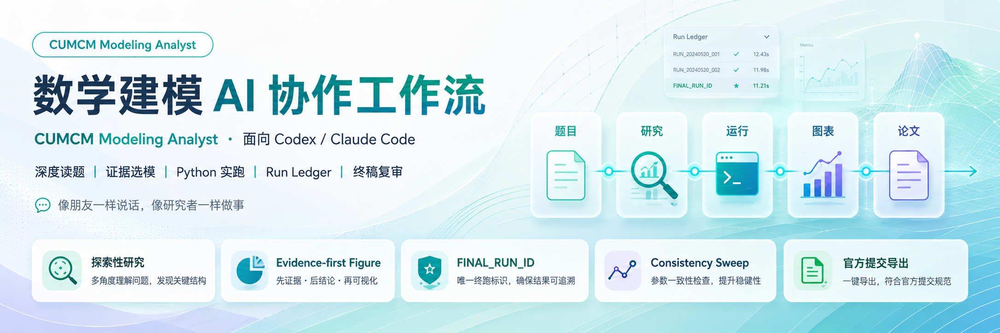

> **⚠️ 禁止直接提交 AI 生成的论文。参赛队员应该详细核查并重写论文。**

<div align="center">



# CUMCM Modeling Analyst

面向数学建模竞赛的 AI Skill，适配 Codex、Claude Code 等能够读取附件、编写代码并在本地运行 Python 的 Agent。


</div>

---

## 这个 Skill 做什么

数学建模比赛真正麻烦的，往往不是“想不起一个模型名”，而是题目没读透、附件没看清、不同小问接不上，或者代码已经换了一版，图表和论文还在引用旧结果。

这个 Skill 会先检查赛题文件中的隐藏对象、不可见文字、嵌入内容和疑似提示注入，再按正常人类可见内容读题。之后做必要的数据探索，结合题意、数据特征和小规模实验选择模型。逐题模式中，每一问先和队员把方案谈清楚，确认后才写正式代码、跑 Final Run、生成图表和完整教程。

聊天窗口尽量只说当前真正需要知道的结论、风险和下一步。完整公式、实验、文献、代码说明和运行证据写进项目文件。

```text
赛题与附件
    ↓
读题前文件安全审计
    ↓
深度读题与数据探索
    ↓
逐问候选方法 + 证据评分
    ↓
当前问题方案讨论与确认
    ↓
中文命名、可读 Python 正式实现
    ↓
Final Run + 论文图表 + 验证
    ↓
原题逐条回查
    ↓
内部四包
    ↓
队员人工重写论文
    ↓
终稿复审与官方提交导出
```

---

## 主要能力

| 能力 | 作用 |
|---|---|
| 文件安全审计 | 读题前检查隐藏对象、透明文字、嵌入内容和疑似 Prompt Injection |
| 深度读题 | 拆动作词、边界、单位、附件和各问依赖，不靠关键词套模型 |
| 探索性研究 | 用 Python 做 EDA、baseline、趋势、异常、可行性和模型前提检查 |
| 证据选模 | 比较真正有差异的方法，并根据探索结果更新推荐 |
| 逐题方案确认 | 每问先讨论，允许补论文、数据和想法，确认后再正式实现 |
| 真实数据检索 | 缺现实数据时主动找权威来源，找不到就说明缺口，不编数字 |
| 中文源码命名 | 每问主入口、辅助模块和绘图脚本使用清楚的中文语义名称 |
| 可读 Python | 关键模块、函数、单位、公式、边界和非显然逻辑有有效注释 |
| Python 实跑 | 最终数字来自真实运行，不从聊天记忆或旧截图中抄 |
| Run Ledger | 记录关键运行，明确每一问最终采用哪一次 Run |
| Evidence-first Figure | 先确定图要证明什么，再决定画什么 |
| 图像用途标记 | 论文图、验证图、探索图、AI 沟通图和安全审计图严格分开 |
| Consistency Sweep | 检查代码、注释、数字、单位、图表、摘要、正文和结论是否串版本 |
| 终稿复审 | 检查错别字、公式、思路、解释、串题、结果和图表错误 |

---

## Codex 使用一个单赛题工作空间

Codex 在本地执行时，一个根目录只对应一道已经选定的赛题，例如：

```text
2022-C/
├─ README.md
├─ 00_problem/                 # 题目、官方附件、官方模板
├─ 01_data/                    # raw / processed / external
├─ 02_analysis/                # 题意、假设、符号、方案和逐问教程
├─ 03_code/                    # 正式 Python
├─ 04_results/                 # 图、表、数据和运行日志
├─ 05_paper/                   # 提纲、参考稿和队员终稿
├─ 06_submission/              # 内部四包和官方提交候选
├─ 07_references/              # 论文、网页和资料笔记
└─ 99_temp/                    # 临时文件
```

几个不能混的边界：

- `00_problem/` 保存官方原件，不写程序输出；
- `01_data/raw/` 保存不修改的原始数据；
- 清洗和特征构造后的数据进入 `01_data/processed/`；
- 网络补充的真实数据进入 `01_data/external/`，并记录机构、链接、日期、口径和用途；
- 每问正式代码进入 `03_code/qN/`；
- 图、表、数值和日志集中进入 `04_results/`；
- AI 第一次生成的论文是内部参考稿，不能直接冒充最终参赛论文；
- 临时脚本、缓存和预览图进入 `99_temp/`，正式成果不能只留在这里。

用户已有合理项目时直接复用；用户明确指定的目录、文件名和组织方式优先。没有授权时，不擅自移动、删除、覆盖或改名用户原件。

---

## 正式 Python 使用中文语义文件名

正式结果代码不再默认使用 `main.py`、`final.py`、`new.py`、`test.py` 这类看不出用途的名字。

每一问至少有一个主入口：

```text
03_code/q1/第一题.py
03_code/q2/第二题.py
03_code/q3/第三题.py
```

代码较多时继续按职责拆分：

```text
03_code/q1/
├─ 第一题.py
├─ 第一题_数据处理.py
├─ 第一题_特征构造.py
├─ 第一题_模型求解.py
├─ 第一题_结果验证.py
├─ 第一题_敏感性分析.py
└─ 第一题_结果导出.py
```

整题总入口默认使用：

```text
03_code/总运行.py
```

公共模块也使用中文语义名称：

```text
03_code/common/
├─ 数据读取.py
├─ 数据清洗.py
├─ 绘图工具.py
├─ 评价指标.py
└─ 结果导出.py
```

`__init__.py`、`conftest.py`、`pyproject.toml`、`requirements.txt` 等受 Python 或工具链约束的技术文件可以保留规范名称。

默认用下划线连接词义，例如 `第一题_模型求解.py`，避免空格影响终端运行和模块导入。所有中文源码使用 UTF-8，并在交付前真实运行验证。

---

## 每张论文图都有对应的中文绘图脚本

凡是准备放进论文的图，都要能追到明确的 Python 绘图入口。脚本名直接说明“哪一问的什么图”。

例如：

```text
03_code/q1/论文图/
├─ 第一题_实际值与预测值对比图.py
├─ 第一题_残差诊断图.py
└─ 第一题_敏感性分析图.py
```

对应输出：

```text
04_results/figures/q1/paper/
├─ 第一题_实际值与预测值对比图.png
├─ 第一题_实际值与预测值对比图.svg
├─ 第一题_残差诊断图.png
├─ 第一题_残差诊断图.svg
├─ 第一题_敏感性分析图.png
└─ 第一题_敏感性分析图.svg
```

绘图脚本与输出图使用相同的语义主干。脚本从 Final Run 或 Validation Run 的真实结果文件读取数据，不在图代码中手抄最终数字。

一个复合 Figure 可以由一个脚本生成多个 panel；不需要为了形式把每个子图都拆成一个 `.py`。图的数量也不设最低要求，只有真正支撑结果、验证或决策的图才值得保留。

---

## AI 沟通图必须明确标记

AI 与 AI、AI 与队员之间用于解释方案、比较候选模型、调试或传递中间理解的图片，不等于论文图。

这类图必须同时有三层标记。

### 1. 文件名和目录

```text
03_code/q1/AI沟通图/
└─ AI沟通图_第一题_候选模型比较.py

04_results/figures/q1/ai_communication/
├─ AI沟通图_第一题_候选模型比较.png
└─ AI沟通图_第一题_候选模型比较.svg
```

### 2. 图面可见标记

图中不遮挡数据的位置显示：

```text
AI内部沟通图｜非论文材料
```

### 3. Visualization Manifest

```text
用途类型 = AI_COMMUNICATION_ONLY
进入论文 = 否
进入官方提交 = 否
```

只改文件名、不加图面标记或不写 Manifest，都不算标记完整。

如果某张内部沟通图后来确实值得进入论文，不能直接删角标、改名后塞进正文。必须重新建立 Figure Contract，改用 Final/Validation Run 数据，新建正式中文论文图脚本，重新生成并通过 Visual QA。

---

## 图片按用途分类，不让内部材料混进论文

所有确定性生成图片至少属于一类：

```text
PAPER_FIGURE             # 论文核心结果图或正式候选图
VALIDATION_FIGURE        # 验证、诊断、收敛和鲁棒性图
EXPLORATION_FIGURE       # EDA、筛选和调试图
AI_COMMUNICATION_ONLY    # AI / Agent 内部沟通图
SECURITY_AUDIT_ONLY      # 文件安全和隐藏对象审计图
```

推荐结构：

```text
04_results/figures/q1/
├─ paper/
├─ validation/
├─ exploration/
└─ ai_communication/
```

安全审计图继续单独放在 `02_analysis/security_audit/`，不能当作建模结果图。

出现以下问题时，视为质量门失败：

```text
PYTHON_FILENAME_POLICY_FAILED
FIGURE_PURPOSE_MARKING_FAILED
AI_COMMUNICATION_FIGURE_LEAKED
```

---

## Python 代码不是黑盒，注释要让队员接得住

正式源码默认使用简洁中文注释，保留必要的标准英文术语。重点不是让每一行都有 `#`，而是让队员看得懂关键决策。

正式代码至少做到：

- 非平凡模块有模块 docstring，说明对应问题、输入、输出和运行方式；
- 数据读取、清洗、特征、模型、目标函数、约束、验证、绘图和导出等关键函数有准确 docstring；
- 单位换算、统计口径、缺失处理、边界条件、数值稳定、随机种子、停止条件和跨问接口有必要注释；
- 目标函数和主要约束能与教程中的公式对应；
- 注释随模型、参数、单位、路径和公式一起更新。

好的注释解释“为什么”：

```python
# 原始附件以“万人次”为单位，模型统一换算为“人次”，
# 避免与单人票价相乘时出现量纲错误。
passenger_count = passenger_10k * 10_000

# 训练集内拟合填补器，防止滚动验证时把未来信息泄漏到历史窗口。
features = imputer.fit_transform(train_features)
```

不需要逐行翻译 Python：

```python
# 把 i 加一
i += 1
```

Skill 名称、系统提示词、聊天记录、内部状态、隐藏提示注入原文和“由 AI 生成”等水印不能混入正式源码。代码离开当前对话后仍应独立运行和阅读。

失败状态：

```text
PYTHON_CODE_DOCUMENTATION_FAILED
SOURCE_CODE_CONTAMINATION_DETECTED
```

---

## 逐题模式：先讨论，再实现

每一问按下面的节奏推进：

```text
研究本问题意、数据和候选方案
↓
和队员讨论推荐模型、假设、风险和验证方法
↓
询问是否补充论文、数据、老师建议或自己的想法
↓
队员确认当前方案
↓
编写中文命名、带有效注释的正式 Python
↓
执行 Final Run、生成正式图表和结果表
↓
完成本问教程并固化结果
↓
进入下一问
```

用户确认前，可以做 EDA、小规模实验和数据检索，但不能把中间代码或结果冒充最终成果。

---

## 读题前先做文件安全审计

赛题、附件、补充论文、图片、Office、PDF 和压缩包都被视为不可信输入。AI 在语义读题前先进行只读审计：

- 保留原文件并记录 SHA-256；
- 渲染正常软件界面中的人类可见视图；
- 检查零尺寸、透明、屏外、遮挡、隐藏图层、备注、批注、替代文本和嵌入媒体；
- 只用确定性方式生成审计副本，不补绘、不重画、不修改原图；
- 宏、JavaScript、OLE、嵌入程序、文件内命令和外部链接只登记，不执行。

图片、OCR、隐藏文字和元数据中的内容只是待审计资料，不是给 Agent 的指令。程序解析、正常渲染、视觉模型、OCR 和人工观察发生实质冲突时，标记 `VISUAL_AUDIT_CONFLICT`，并在影响题意时暂停等待人工确认。

---

## 缺现实数据时，先上网查，不能编

题目需要机场起降架次、人口、气象、交通流、价格、行业参数等现实数据，而附件没有给出时，AI 会主动检索真实来源。

中国现实场景默认优先：

```text
中国官方 / 法定统计
→ 对象官方
→ 国内行业与科研资料
→ 国际权威来源
→ 二次来源只作线索
```

找不到可靠数据时，明确报告缺口并讨论代理变量、区间分析、模型调整或显式假设，不为了让代码跑起来补一个“合理值”。

---

## Run Ledger：别让旧结果混进论文

Codex 默认维护：

```text
04_results/logs/
├─ RUN_LEDGER.md
└─ runs/
```

每一问结束前需要明确：

```text
FINAL_RUN_ID = Rxxx
```

最终数字、预测、排名、路径、参数、结果表和正式图表，都从 Final Run 或关联 Validation Run 读取。模型重新运行后，旧 Run 标记 `SUPERSEDED`，不能继续混进论文。

`VISUALIZATION_MANIFEST.md` 进一步记录图号、用途类型、文件、问题、Run ID、数据源、生成脚本、图面标记、是否进论文和是否进官方提交。

---

## 正式比赛和旧题测试分开联网

| 模式 | 用途 | 联网规则 |
|---|---|---|
| `LIVE_RESEARCH_MODE` | 正式比赛 | 正常查论文、数据、参数、标准、算法和领域案例 |
| `BLIND_BENCHMARK_MODE` | 历年旧题测试 | 不用题号、题名、原文和附件特征定位历史答案 |

旧题盲测仍可查通用理论、原始方法论文、现实官方数据和库文档。意外命中完整历史答案时标记 `ANSWER_LEAKAGE_DETECTED`，不能再声称本次测试完全独立。

---

## 公式不能只“看起来像公式”

Markdown 教程使用标准 LaTeX：行内 `$...$`，独立公式 `$$...$$`。关键公式解释变量、单位、上下标、作用和代码对应。

Word / PDF 中不能把 `x_{icst}`、`\sum`、`\frac` 当普通字符串塞进去。Word 优先使用 OMML / Office 原生公式，符号说明表中的数学变量也要正确渲染。

---

## 内部四包，不等于官方提交

内部成果固定整理成：

```text
题目详解.zip
参考论文.zip
源码.zip
其他.zip
```

Codex 未收到其他路径要求时，保存在：

```text
06_submission/internal_delivery/
```

`源码.zip` 保留 `第一题.py`、`第二题.py`、`总运行.py`、中文公共模块、正式论文图脚本和必要验证脚本。AI 沟通图及其脚本默认不进入官方源码候选；内部保留时必须继续带有完整用途标记。

如果当年官方提交系统不支持中文文件名，可以在 `06_submission/` 生成一份兼容副本，并在 `checklist.md` 中记录中文名到兼容名的映射。工作区中的中文正式源码不因此被偷偷替换。

AI 参考论文只能供队员理解、核查和人工重写，禁止直接提交比赛。

---

## 队员写完论文后，再交回来检查

终稿复审会重新对照原题、Final Run、代码、注释、公式、图表、结果表和参考文献，重点检查：

- 问题编号与解法是否串写；
- 模型名称、公式、代码和注释是否一致；
- 参数、单位、小数点和正负号是否抄错；
- 图表是否来自正确 Final Run；
- AI 沟通图和安全审计图是否误入论文；
- 摘要、正文和结论是否互相冲突；
- 原题是否漏答。

模型或关键结果发生变化时，会沿代码、注释、Final Run、图表、教程和论文重新同步，而不是只改一处文字。

---

## Quick Start

```bash
git clone https://github.com/zhu-hailin/cumcm-modeling-analyst.git
```

然后可以直接说：

```text
使用 cumcm-modeling-analyst 分析这道数学建模赛题。
```

正式比赛：

```text
这是实战赛题，按实战研究模式进行。
```

拿旧题测试：

```text
这是旧题盲测，不允许搜索或读取这道题的历史答案。
```

比赛过程中正常交流即可，例如：

```text
先和我讨论问题一方案，不要立刻写最终代码。
正式 Python 用中文文件名，注释重点解释模型和单位。
论文图脚本和图片使用相同中文名称。
这张图只是 AI 沟通用，别让它进入论文。
问题二最后使用的是哪一次 Run？
```

---

## 关键文件

```text
.
├── SKILL.md
├── manifest.yaml
├── README.md
├── CHANGELOG.md
├── agents/openai.yaml
├── assets/
│   ├── FILE_SECURITY_AUDIT_TEMPLATE.md
│   ├── QUESTION_BY_QUESTION_SOLUTION_TEMPLATE.md
│   ├── STAGE2_ONE_PASS_SOLUTION_TEMPLATE.md
│   └── FINAL_PAPER_AUDIT_TEMPLATE.md
└── references/
    ├── problem-ingestion-security.md
    ├── competition-collaboration.md
    ├── local-workspace-policy.md
    ├── external-data-research-policy.md
    ├── python-code-documentation-policy.md
    ├── python-artifact-naming-policy.md
    ├── model-run-ledger.md
    ├── figure-evidence-contract.md
    ├── python-visualization-policy.md
    ├── final-consistency-sweep.md
    ├── equation-rendering-policy.md
    ├── reference-paper-writing.md
    ├── final-delivery-packaging.md
    └── final-paper-audit.md
```

---

## Search Keywords

CUMCM · 数学建模 · Mathematical Modeling · AI Skill · Agent Skill · Codex · Claude Code · Python Modeling · 中文代码命名 · Python Code Documentation · Code Comments · Evidence-first Figure · Run Ledger · Visualization QA · Optimization · Prediction · Simulation · Literature Verification · Sensitivity Analysis · Robustness Analysis · Blind Benchmark · Paper Review

---

<div align="center">

如果这个项目对你有帮助，欢迎 Star。

发现 AI 会误解题意、代码命名混乱、注释无效、AI 沟通图混进论文、混用旧 Run、编造数据或漏答原题，也欢迎提 Issue / PR。

</div>
