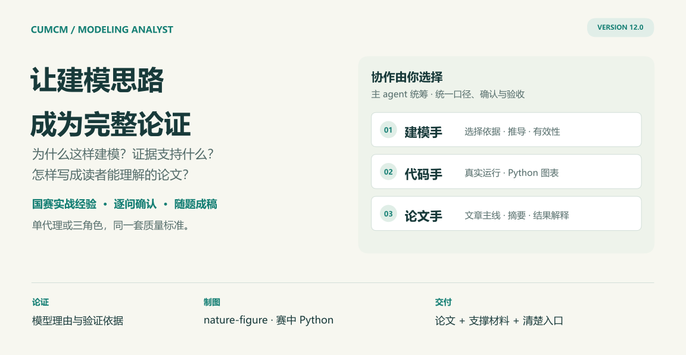
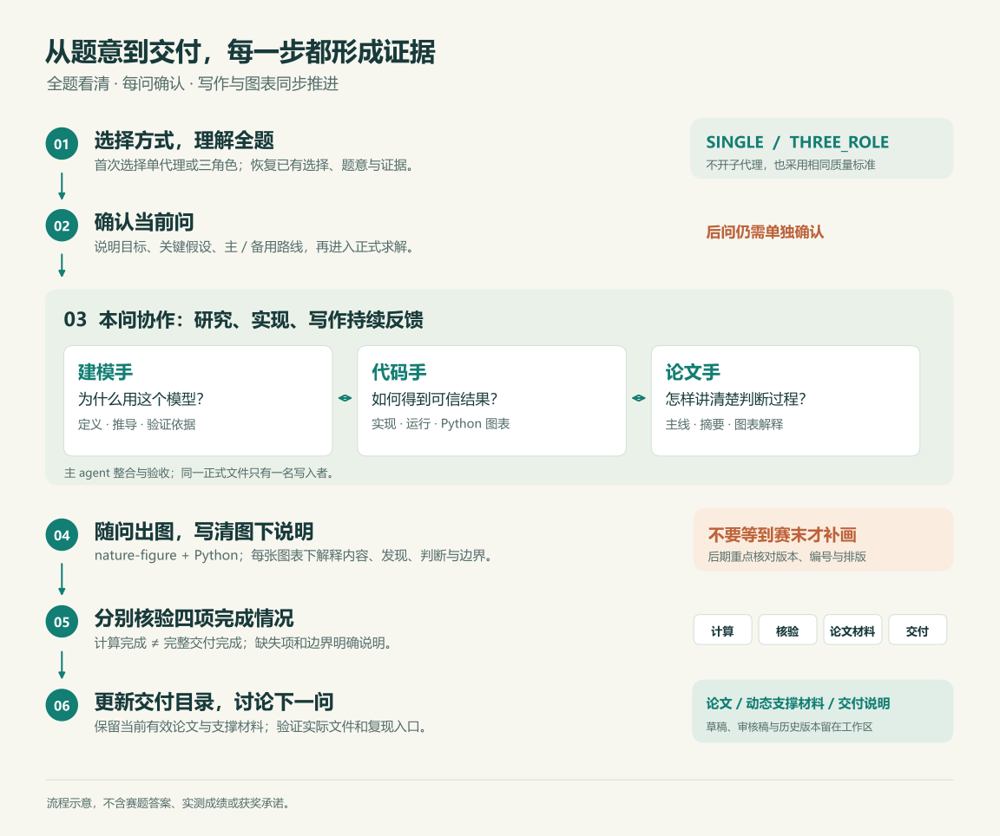

<p align="center">
  
</p>

# CUMCM Modeling Analyst

**经过国赛实战使用的数学建模协作 Skill。** 把题目、模型与证据，组织成队员能理解的论文和交付物。

[](CHANGELOG.md)
[](https://github.com/zhu-hailin/cumcm-modeling-analyst/actions/workflows/validate.yml)
[](requirements-tools.txt)

[协作方式](#collaboration) · [比赛流程](#workflow) · [快速开始](#start) · [论文与图表](#paper) · [交付目录](#delivery) · [验证与维护](#development)

这个 Skill 已在全国大学生数学建模竞赛中实际使用。v12 结合比赛中 Agent 暴露的问题、团队的真实交付经验，以及经指导教师指导的论文结构进行升级：保留逐问确认，完善角色交接、建模论证、摘要和交付目录。

比赛实践让我们更加重视：得到一个答案之后，还需要说清楚为什么这样建模、关键选择依据什么、结果如何验证、如何据此作出判断。论文与图表需要随解题推进，队员自己的思考和表达也需要保留。这些经验构成 v12 的设计出发点。

队员需要理解、核查、参与表达并确认论文。AI 披露和提交要求按适用规则执行；工作稿不自动等于参赛终稿，也不承诺获奖等级。

<a id="collaboration"></a>

## 单代理，或三位搭档

首次完整赛题项目询问一次，选择会在项目中保留。局部解释、审稿、修图不增加这道提问。

| 方式 | 谁负责 | 质量标准 |
|---|---|---|
| `SINGLE` | 主 agent 承担建模、代码、论文与整合 | 与三角色相同 |
| `THREE_ROLE` | 主 agent 统筹，建模手、代码手、论文手按需协作 | 同一版本、明确交接、主 agent 验收 |

| 角色 | 核心问题 | 交回成果 |
|---|---|---|
| 建模手 | 为什么选这个模型，怎样推导和验证？ | 模型规格、关键决策、推导、验证设计与解释 |
| 代码手 | 数学定义怎样准确落到真实计算？ | 代码、运行结果、Python 图表、检查与复现入口 |
| 论文手 | 怎样让读者理解论证并看到关键发现？ | 从早期组织的正文、摘要、图表下方说明和证据缺口 |
| 主 agent | 口径是否一致，任务是否真正完成？ | 逐问确认、整合、验收和当前有效交付物 |

同一正式文件只有一名写入者。角色冲突回到题意、推导和计算，不以投票或互相说“通过”代替验证。不开子代理也能走完同一流程。详见[协作规范](references/multi-agent-collaboration.md)。

<a id="workflow"></a>

## 全题看清，逐问确认，随题成稿

<p align="center">
  
</p>

**认可整题路线，不代替后问确认。** 已确认本问内的实现、调参、求解器调整、验证和修复可自主完成；目标、关键约束或影响结论的重要假设变化时，再由队伍决定。

每问保留一份可定位的交接，说明答案、模型理由、关键推导、实验、验证与限制。关键决策和 Run 引用同一权威记录，不堆聊天流水账。

已有可靠答案后，比较继续调参与补齐论证、摘要、图表和交付的收益。分别报告计算、核验、论文材料、交付四项状态，不把“跑完代码”说成“整题交付完成”。

<a id="start"></a>

## 快速开始

### 直接把链接发给 agent

无需先手动安装。将下面这段话和赛题附件一起发给具备联网、文件读写和运行能力的 agent：

```text
使用 skill：https://github.com/zhu-hailin/cumcm-modeling-analyst 开始数学建模比赛。
请先下载完整建模 skill 并读取 SKILL.md，再根据其中要求下载 nature-skills，
读取 nature-figure 的入口和 Python 分支；已有完整副本则核对后复用。
赛题见附件。先讨论第一问方案，等我确认后正式求解。
```

**给 agent 的接入步骤：** 先将本仓库完整下载到可写项目的依赖目录，读取 [SKILL.md](SKILL.md) 与 [manifest.yaml](manifest.yaml)，再按[链接启动规范](references/link-bootstrap.md)获取 nature-skills 的已核对版本并读取其完整技能资源。首次完整比赛项目在启动阶段准备两个技能，随后恢复项目状态、询问尚未选择的协作模式并读题。用户无需再单独发送 nature-skills 链接。

已有可靠副本时复用，在项目说明记录实际路径和版本；不覆盖本地修改，不自动改变全局安装。若 agent 无法联网或保存文件，它应明确说明缺口，不能声称已下载或已加载。链接是获取入口，能否直接执行取决于所用 agent 的实际能力。

### 手动获取与接入（可选）

```bash
git clone https://github.com/zhu-hailin/cumcm-modeling-analyst.git
git clone https://github.com/Yuan1z0825/nature-skills.git
```

将本 Skill 和完整的 `nature-skills/skills/nature-figure/` 放到所用 agent 能发现的位置，或明确指定入口路径。按实际引用保留 `nature-shared/`；不要只复制单个 SKILL.md。克隆不等于所有应用都已自动注册。

本版核对 nature-figure 2.8.0，commit `9e2d90e2171a61dc0ae072e43e8d16e3fc73572f`。项目记录实际使用版本并在赛中复用，具体接入见[nature-figure 与 Python 制图](references/python-visualization-policy.md)。

### 一段完整的启动请求

```text
使用 cumcm-modeling-analyst 分析附件中的赛题。
先恢复已有状态；新项目询问一次单代理或三角色协作。
完成必要的初始题包审计、全题拆解和路线研究，
给出每问交付项、建模理由、风险和跨问接口。
论文从现在开始组织，图表在各问过程中用 Python 和 nature-figure 生成。
先讨论第一问方案，等我确认后再正式求解。
```

选定模式、确认当前问后：

```text
确认第一问方案。完成真实计算、关键核验、必要图表和本问论文材料。
每张图表下写明展示什么、反映什么、支持什么判断和必要边界。
更新交付文件夹，分别说明四项完成状态，暂不求解第二问。
```

只需解释、修图或审稿时直接提出该任务。没有运行能力时可继续推导和实施规格，计算结果明确“待运行”。初始题包审计锁定后复用，不因新会话、子代理或切换问题重做。

旧题盲测需先冻结独立方案和成果，再由用户明确解锁历史答案；参考后形成的改进标为 `POST_HOC`。

<a id="paper"></a>

## 论文有骨架，论证有来由

[论文骨架模板](assets/PAPER_OUTLINE_TEMPLATE.md)按不同题型组织，不固定问题数量：

> 任务与困难 → 为什么选这个模型 → 假设、变量、目标与约束 → 求解 → 结果与解释 → 最优性依据或有效性验证 → 边界与后问接口。

优化题有相应证据才能声称最优；可行解、数值证书、理论证明和启发式结果分别表达。预测题应验证泛化与信息边界，不机械套用“最优性证明”。

[摘要与论证](references/abstract-and-argumentation.md)围绕困难、设计、结果、解释和取舍组织，保留队员已经写好的有效表达。结果较好但另一指标恶化时，要交代权衡与最终选择，不能包装成全面优势。

### 图表在比赛过程中生成

论文图表统一使用 [nature-skills 的 nature-figure](https://github.com/Yuan1z0825/nature-skills/tree/main/skills/nature-figure)，**选择 Python 分支，在每问建模、实验和验证过程中生成、解释并迭代**。后期处理版本、编号、排版与样式，不集中补画全部图表。

每张图下有解释性图注，每张表下有表注：对象与比较条件是什么、反映什么、支持何种判断、结论有什么边界。图题不能代替解释。数据、Python 代码和实际检查报告可追溯，结果表保留可编辑数据。

图形设计和视觉 QA 由 nature-figure 负责，本仓库不维护第二套配色、布局或导出标准，也不将 Nature 期刊投稿配额套到国赛。无新增信息时不凑图；需要的图表不能拖到最后。

模型计算工具按团队实际选择，可以使用 Python、MATLAB、R、Excel、SPSS/SPSSPRO 等；**不要求所有队伍使用 SPSSPRO**。这一自由不改变论文制图明确采用 Python 的约定。

<a id="delivery"></a>

## 一个清楚的交付入口

```text
交付文件夹/
├─ 交付说明.md
├─ 交付清单.json
├─ 论文/
└─ 支撑材料/
   ├─ 01_结果表/
   ├─ 02_求解代码与输入/
   ├─ 03_补充实验/
   ├─ 04_验证记录/
   └─ 05_论文图表/
```

默认位于赛题工作区内，用户已有指定目录优先；按实际内容创建。交付目录保留当前有效成果，草稿、审核稿、历史备份留工作区。尚无整篇有效稿时写明进度，不放置冒充终稿的论文。

**支撑材料动态管理。** 代码、输入、结果、图表和验证记录有变化时，主 agent 在同一轮更新对应材料、交付说明及清单，不等每问结束或赛末。上游变化先将受影响旧副本标为过期/待更新，新版核验后再恢复就绪；保留队员改动和工作区历史。每问结束再核对一次整体状态。

[交付说明模板](assets/DELIVERY_README_TEMPLATE.md)说明环境、外部输入、运行顺序、预期结果与已验证范围。区分重新求解和重建冻结结果，最终包在隔离副本验收；不能按扩展名删除脚本依赖的文档。

旧的四包组织方式仍可按需导出。官方上传的格式、容量、页数、匿名与 AI 披露要求按实际比赛核验，不写死一届比赛的限制。

<a id="development"></a>

## 验证与维护

| 文件或工具 | 用途 |
|---|---|
| [SKILL.md](SKILL.md) / [manifest.yaml](manifest.yaml) | 入口、按需路由与外部绘图依赖 |
| [references/](references/) / [assets/](assets/) | 工作流、论证与协作模板 |
| [run_record.py](scripts/run_record.py) | 真实运行、输入快照与新输出检查 |
| [delivery_check.py](scripts/delivery_check.py) | 目录/ZIP、清单及文件机械检查 |
| [render_readme_assets.py](scripts/render_readme_assets.py) | 本页介绍图的可复现生成代码 |
| [scenarios.json](tests/scenarios.json) / [scenario_rubric.md](tests/scenario_rubric.md) | 实际行为试用与评阅标准 |

`scripts/figure_utils.py` 只保留旧项目兼容，不作为新论文图的规范或 QA 入口。

辅助工具需 Python 3.11+；模型环境与 nature-figure 环境按各自实际需求准备：

```bash
python -m pip install -r requirements-tools.txt
python scripts/delivery_check.py /path/to/交付文件夹 --json
python scripts/delivery_check.py /path/to/论文 --profile reference-paper --paper-source latex
python scripts/delivery_check.py /path/to/最终论文.zip --profile reference-paper --paper-source none
```

`--paper-source` 可为 `docx`（兼容默认）、`latex` 或 `none`，论文 profile 始终要求 PDF。使用 `--require` 指定必需文件，`--manifest` 核对清单。机械通过不等于数学正确、真实复现完成或页面视觉通过。

在仓库根目录运行：

```bash
python scripts/quick_validate.py
python tests/test_competition_first_contract.py
python tests/test_old_problem_forward_contract.py
python tests/test_helper_tools.py
python tests/test_reliability.py
python tests/test_delivery_directory.py
python tests/test_figures.py
```

GitHub Actions 保留 Ubuntu/Windows、Python 3.11/3.12 矩阵。`test_figures.py` 验证旧工具兼容，不代表 nature-figure 图件验收。静态检查与微型试用也不等于真实限时比赛表现。

完整更新见 [CHANGELOG.md](CHANGELOG.md)。欢迎以最小复现材料提交 [Issue](https://github.com/zhu-hailin/cumcm-modeling-analyst/issues) 或 [PR](https://github.com/zhu-hailin/cumcm-modeling-analyst/pulls)。
